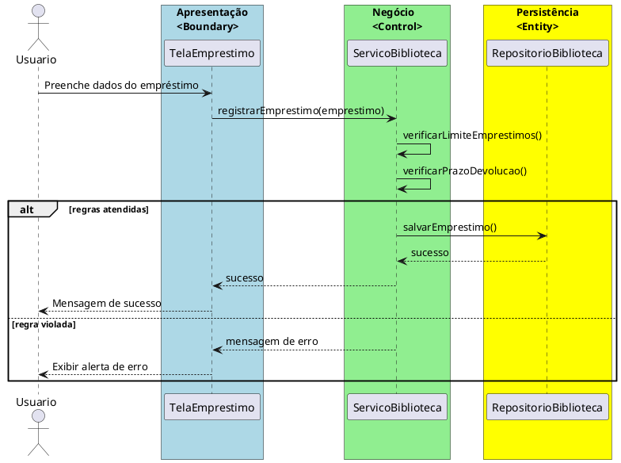

# Trabalho 25 – Sistema de Gerenciamento de Biblioteca Comunitária – Acervo e Empréstimos

## Cenário
Uma biblioteca comunitária precisa de um sistema desktop para gerenciar seu acervo, controlar empréstimos e devoluções e organizar o cadastro de leitores. O sistema será desenvolvido em **Java**, usando **JavaFX** para a interface e seguindo a arquitetura em **três camadas** (Apresentação, Negócio e Dados).

## Requisitos Funcionais
| Camada | Funcionalidade |
|--------|----------------|
| **Apresentação (JavaFX)** | Tela de cadastro de livros, tela de registro de empréstimos e devoluções, tela de consulta ao acervo (por título/autor) e tela de listagem de leitores. Cada tela deve exibir mensagens de erro claras. |
| **Negócio** | • Validar dados de entrada (título, autor, ISBN, matrícula do leitor).  • Aplicar as regras de negócio descritas abaixo. |
| **Dados** | • Armazenar livros e empréstimos em memória (`ArrayList`, `HashMap`).  • Implementar operações CRUD para livros, leitores e empréstimos. |

## Regras de Negócio (2)
1. **Limite de Empréstimos por Leitor** – Cada leitor pode ter no máximo 3 livros emprestados simultaneamente. Ao tentar registrar um novo empréstimo acima desse limite, a operação deve ser abortada e o usuário deve receber uma mensagem de aviso.
2. **Prazo de Devolução** – Cada empréstimo possui prazo de 14 dias. Em caso de devolução em atraso, o sistema deve registrar multa e bloquear novos empréstimos do leitor até a regularização.

## Fluxo de Comunicação Entre as Camadas
1. O usuário interage com a interface JavaFX (ex.: registrando um novo empréstimo).
2. A **Camada de Apresentação** envia os dados ao **Serviço de Biblioteca** (camada de negócio).
3. O serviço verifica as regras de negócio (limite de empréstimos e prazo de devolução). Se válidas, delega ao **Repositório de Biblioteca** (camada de dados). Se violadas, retorna um erro.
4. A **Camada de Apresentação** recebe o retorno e exibe um `Alert` ao usuário (sucesso ou erro).

### Diagrama de Sequência

## Barema de Avaliação (100 pontos)
| Área | Peso | Critérios |
|------|------|-----------|
| **Interface Gráfica (JavaFX)** | 20 pts | Funcionalidade completa, usabilidade e tratamento de mensagens de erro. |
| **Camada de Negócio** | 30 pts | Implementação correta das regras de limite e prazo, tratamento de exceções. |
| **Camada de Dados** | 20 pts | Uso adequado de coleções, operações CRUD funcionais. |
| **Separação em Camadas** | 20 pts | Arquitetura em 3 camadas bem definida e comunicação correta. |
| **Boas Práticas** | 10 pts | Código limpo, organização de pacotes e nomes coerentes. |

## Entregáveis
1. Projeto Java completo (Maven ou Gradle) com pacotes `presentation`, `business`, `data` e `model`.
2. **README** com instruções de compilação e execução.
3. Diagrama de Classes (UML) mostrando as entidades (`Livro`, `Leitor`, `Emprestimo`).
4. Diagrama de sequência (como o acima) para o caso de uso **Registrar Empréstimo**.
