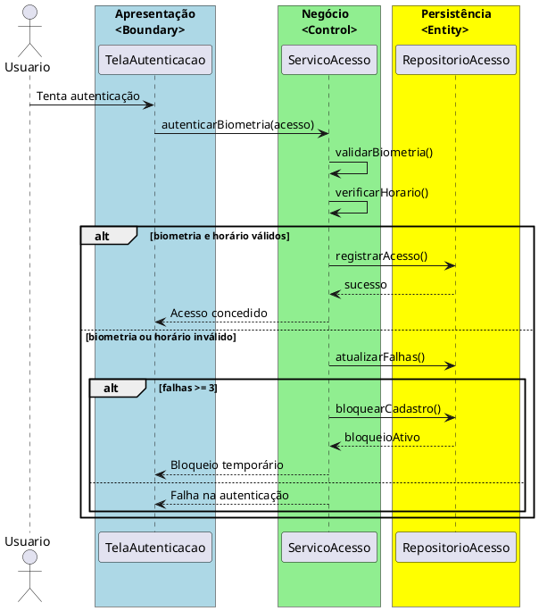

# Trabalho 26 – Sistema de Controle de Acesso Biométrico

## Cenário
Uma empresa precisa de um sistema para controlar o acesso a áreas restritas usando tecnologia biométrica (reconhecimento facial ou digital de impressão digital). O sistema será desenvolvido em **Java**, com interface **JavaFX** e arquitetura em **três camadas**.

## Requisitos Funcionais
| Camada | Funcionalidade |
|--------|----------------|
| **Apresentação (JavaFX)** | Tela de cadastro de usuários (nome, código biométrico), tela de registro de acesso, janela de autenticação biométrica.
| **Negócio** | • Validar dados de entrada (nome, biométrico, horário).  
• Aplicar regras de acesso (horários permitidos, biometria válida).
| **Dados** | • Armazenar registros de acesso e usuários (`HashMap`, `ArrayList`).
| 

## Regras de Negócio (3)
1. **Autenticação Biométrica Válida** – A biometria deve corresponder ao cadastro com 95% de confiança mínima. Se houver discrepância, a autenticação falha.  
2. **Período de Acesso Autorizado** – Acesso só permitido entre 08:00 e 18:00. Fora deste intervalo, registra bloqueio temporário.  
3. **Bloqueio por Falhas Consecutivas** – Após 3 falhas consecutivas, o sistema bloqueia o cadastro por 15 minutos.

## Fluxo de Comunicação
1. Usuário inicia autenticação biométrica.
2. Camada de Apresentação envia dados ao Serviço de Acesso.
3. Serviço verifica regras de autenticação e horário.
4. Se válido, atualiza registro de acesso. Se não, incrementa falhas e pode bloquear.
5. Camada de Apresentação mostra status ao usuário.

### Diagrama de Sequência

## Barema de Avaliação (100 pontos)
| Área | Peso | Critérios |
|--------|------|------------|
| Interface (JavaFX) | 20 pts | Tela de autenticação clara, tratamento de tentativas
| Camada de Negócio | 30 pts | Regras de autenticação e horário implementadas
| Camada de Dados | 20 pts | Registro de acesso e falhas
| Separação em Camadas | 20 pts | Arquitetura clara com 3 camadas
| Boas Práticas | 10 pts | Código limpo e organizado

## Entregáveis
1. Projeto Java (Maven/Gradle) com pacotes `presentation`, `business`, `data`.
2. README com instruções de execução.
3. Diagrama de Classes (UML) para `Usuario`, `AcessoBiometrico`.
4. Diagrama de sequência para autenticação.
