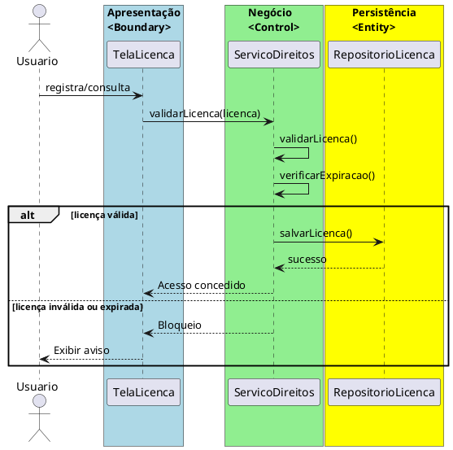

# Trabalho 31 – Sistema de Gestão de Direitos Autorais

## Cenário
 Uma plataforma digital precisa de um sistema para gerenciar direitos autorais, licenças e distribuição de obras (música, vídeos, livros digitais). O sistema será desenvolvido em **Java**, com interface **JavaFX** e arquitetura em **três camadas**.

## Requisitos Funcionais
| Camada | Funccionalidade |
|--------|----------------|
| **Apresentação (JavaFX)** | Tela para registrar licenças, buscar obras por autor, controlar permissões de uso.
| **Negócio** | • Evitar tipos de licença inválidos (CC, proprietária total). • Controlar datas de expiração das licenças. • Validar uso com base na versão da licença (ex.: não comercial, dependente de atribuição).
| **Dados** | • Armazenar obras, autores e licenças em memória (`ArrayList`, `HashMap`).
| 

## Regras de Negócio (3)
1. **Licença Válida** – A obra não pode ser usada se a licença original não estiver registrada no sistema ou se a licença estiver expirada.
2. **Atribuição Obrigatória** – Obras com licença CC devem incluir menção do autor nas derivações.
3. **Bloqueio Automático** – Se uma obra for usada com permissão não concedida, o sistema bloqueia o acesso.

## Fluxo de Comunicação
1. Usuário registra uma nova obra ou busca por autor.
2. Camada de Apresentação envia dados ao Serviço de Direitos Autorais.
3. Serviço valida regras de licença e permissão.
4. Se válido, registra na camada de dados ou permite acesso.
5. Apresentação exibe status ou erro.

### Diagrama de Sequência

## Barema de Avaliação (100 pontos)
| Área | Peso | Critérios |
|------|------|------------|
| Interface (JavaFX) | 20 pts | Registro/consulta de licenças funcional
| Negócio | 30 pts | Validação correta de licença, expiração, permissões
| Dados | 20 pts | Armazenamento de obras e licenças
| Separação em Camadas | 20 pts | Arquitetura clara com 3 camadas
| Boas Práticas | 10 pts | Código limpo, boas práticas de JavaFX

## Entregáveis
1. Projeto Java (Maven/Gradle) com pacotes `presentation`, `business`, `data`.
2. README com instruções de uso.
3. Diagrama de Classes (UML) para `Obra`, `Autor`, `Licenca`.
4. Diagrama de Sequência para validação de licença.
